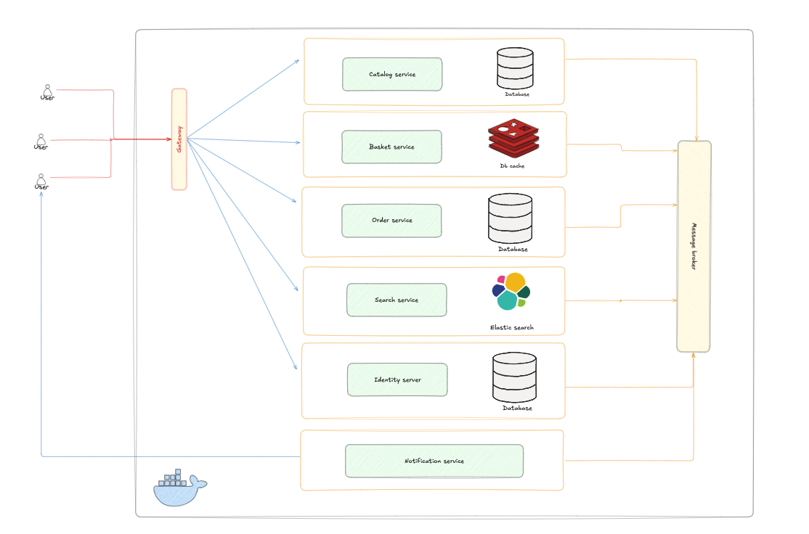

# Overview project 🎇


# Technical stack 🔥

✔ Using [`Mediator`](https://github.com/jbogard/MediatR) for read and write in database<br/>
✔ Using [`FluentValidation`](https://docs.fluentvalidation.net/en/latest/) for validate request and a Validation Pipeline Behaviour on top of MediatR <br/>
✔ Using [`Kafka`](https://kafka.apache.org/) for communicate services <br/>
✔ Using [`Debezium`](https://debezium.io/) for CDC [`Sqlserver`](https://www.microsoft.com/en-us/sql-server/sql-server-downloads) implement `OutboxPattern`<br/>
✔ Using [`SchemaRegistry`](https://docs.confluent.io/platform/current/schema-registry/index.html) persist version message <br/>
✔ Using [`Redis`](https://redis.io/) for caching data <br/>
✔ Using [`Yarp`](https://microsoft.github.io/reverse-proxy/) as a microservices gateway <br/>
✔ Using `Minimal API` for all endpoints <br/>
✔ Using `Docker compose` for our deployment mechanism <br/>
✔ Using `gRPC` for internal communication between our microservices <br/>


# Instruction 🙄
        
| Service              | Status  |
|----------------------|---------|
| Catalog service      | Success |
| Order service        | Success |
| Basket service       | Success |
| Identity service     | Success |
| Notification service | Pending |
| Search service       | Pending |
| Web client           | Pending |


# How to run project 🏃🏻
* Create folder certs and create file https.pfx (for https into communication grpc)
    * Using dev-certs tools dotnet
        ```shell
        dotnet dev-certs -ep ./certs/https.pfx -p <Your_password>
        ```
    * Using openssl
        ```shell

        ```

* Create file `.env` with your environments
    ```dotenv
    MSSQL_PASSWORD=@P@ssw0rd02
    Dabatabase_Name=sqlserver
    
    
    ConnectionStrings__Db=Server=sqlserver;Database=Db;Encrypt=false;User Id=sa;Password=@P@ssw0rd02
    SchemaRegistry__Url=http://schema-registry:8085
    
    ```

And after run command into terminal
```shell
docker compose -f docker-compose.yml up -d
```
#  Review code with SonarQube 😀
Url: https://de7c-113-190-242-151.ngrok-free.app/ <br/>
Uname/upass: cshopuser/Admin123123!@

